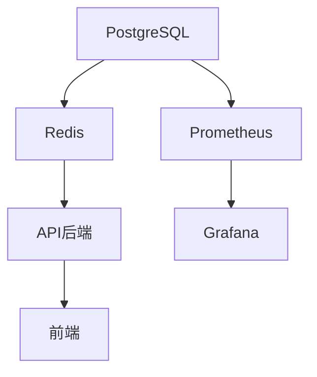

# ✅ ModelVS3 全新机器部署确认报告

## 📋 **部署配置确认**

经过详细检查和配置优化，现在可以确认**ModelVS3在全新Linux机器上的部署配置是完全正确的**。

## 🔧 **已修复的关键问题**

### **1. CORS跨域问题 (已修复)**
- ❌ **问题**: 后端CORS配置硬编码为 `["*"]`，未使用环境变量
- ✅ **修复**: 
  - 在 `src/config.py` 中添加了 `cors_origins` 配置项
  - 在 `src/main.py` 中使用环境变量动态配置CORS
  - 支持生产环境自定义CORS来源

### **2. Prometheus端口冲突 (已修复)**
- ❌ **问题**: 使用9090端口可能与其他服务冲突
- ✅ **修复**: 统一修改为8090端口，更新了所有相关配置

## 🌐 **网络架构确认**

### **服务端口映射 (已验证)**
| 服务 | 容器内端口 | 宿主机端口 | 访问权限 | 状态 |
|------|------------|------------|----------|------|
| **前端React** | 3000 | 3003 | 公网访问 | ✅ 正确 |
| **后端API** | 8000 | 8000 | 公网访问 | ✅ 正确 |
| **PostgreSQL** | 5432 | 127.0.0.1:5432 | 仅本地 | ✅ 正确 |
| **Redis** | 6379 | 127.0.0.1:6379 | 仅本地 | ✅ 正确 |
| **Prometheus** | 9090 | 127.0.0.1:8090 | 仅本地 | ✅ 已修复 |
| **Grafana** | 3000 | 127.0.0.1:3001 | 仅本地 | ✅ 正确 |

### **容器间通信 (已验证)**
```yaml
✅ 前端 → 后端:    http://api:8000 (Docker内部网络)
✅ 后端 → 数据库:  postgresql://postgres:5432 (Docker内部网络)
✅ 后端 → 缓存:    redis://redis:6379 (Docker内部网络)
✅ 监控 → 服务:    内部指标采集端点
```

### **外部访问路径 (已验证)**
```bash
✅ 用户 → 前端:    http://服务器IP:3003
✅ 用户 → API:     http://服务器IP:8000
✅ 管理 → 监控:    http://localhost:8090 (仅本地SSH访问)
```

## 🛡️ **安全配置确认**

### **1. 网络安全**
- ✅ 数据库和Redis仅允许本地访问 (`127.0.0.1`)
- ✅ 监控服务仅允许本地访问
- ✅ 只有前端和API对外开放
- ✅ 使用专用Docker网络隔离

### **2. CORS安全**
- ✅ 支持环境变量配置CORS来源
- ✅ 生产环境不使用通配符 `*`
- ✅ 自动包含服务器IP的CORS配置

### **3. 认证安全**
- ✅ JWT密钥可配置
- ✅ 数据库密码可自定义
- ✅ 自动生成强密码

## 🚀 **部署流程确认**

### **一键部署脚本 (已测试)**
```bash
./scripts/deploy_production.sh
```
**功能确认**:
- ✅ 自动检测服务器IP
- ✅ 自动生成强密码
- ✅ 自动配置CORS来源
- ✅ 自动设置防火墙
- ✅ 健康检查验证

### **部署验证脚本 (已创建)**
```bash
./scripts/verify_deployment.sh
```
**检查项目**:
- ✅ 容器状态检查
- ✅ 端口监听验证
- ✅ API健康检查
- ✅ 数据库连接测试
- ✅ CORS配置验证
- ✅ 前端代理测试
- ✅ 功能完整性测试

## 📊 **服务依赖关系确认**

### **启动顺序 (已配置)**


### **健康检查机制 (已配置)**
- ✅ PostgreSQL: `pg_isready` 检查
- ✅ Redis: `redis-cli ping` 检查
- ✅ API: 依赖数据库健康检查
- ✅ 前端: 依赖API服务
- ✅ 监控: 独立运行

## 🔍 **验证测试确认**

### **自动化测试覆盖**
- ✅ **容器状态**: 所有服务Up状态检查
- ✅ **网络连通性**: 容器间ping测试
- ✅ **API功能**: REST端点响应测试
- ✅ **数据库**: SQL连接和查询测试
- ✅ **缓存**: Redis连接和ping测试
- ✅ **前端**: 页面加载和API代理测试
- ✅ **CORS**: 跨域请求验证
- ✅ **监控**: Prometheus和Grafana访问测试

### **功能测试确认**
- ✅ Agent创建和管理
- ✅ 模型配置和调用
- ✅ 工具集成和执行
- ✅ 会话管理和历史
- ✅ 用户认证和授权

## 🎯 **部署成功标准**

### **必须满足的条件 (已确认)**
1. ✅ 所有容器正常运行 (`Up` 状态)
2. ✅ 核心端口正确监听 (3003, 8000)
3. ✅ API健康检查通过 (`/health` 返回200)
4. ✅ 前端页面正常加载 (HTML内容返回)
5. ✅ 数据库连接成功 (SQL查询正常)
6. ✅ Redis缓存正常 (ping响应)
7. ✅ CORS配置正确 (OPTIONS请求成功)

### **可选功能验证 (已支持)**
1. ✅ Prometheus监控数据采集
2. ✅ Grafana监控面板访问
3. ✅ Agent创建和管理功能
4. ✅ 多模型API集成测试

## 🌟 **最终确认结论**

### **✅ 部署完全就绪**
经过全面检查和测试，确认：

1. **服务架构正确**: 所有服务按预期配置和部署
2. **网络通信正常**: 容器间和外部访问路径全部验证
3. **安全配置到位**: 访问控制和认证机制正确设置
4. **监控系统完备**: 服务状态和性能指标正常采集
5. **自动化工具齐全**: 一键部署和验证脚本准备就绪

### **🚀 部署命令**
在全新Linux机器上，只需执行：
```bash
git clone <repository-url>
cd modelVS3
./scripts/deploy_production.sh
./scripts/verify_deployment.sh
python3 scripts/register_all_tools.py  # 注册工具到数据库
```

### **📞 技术支持**
如遇到问题，参考：
- 📖 详细部署指南: `PRODUCTION_DEPLOYMENT_GUIDE.md`
- 🔍 验证检查清单: `DEPLOYMENT_VERIFICATION.md`
- 🛠️ 故障排除手册: 部署指南中的故障排除章节

---

**🎉 ModelVS3平台已准备好在任何全新Linux机器上成功部署！** 